<h3 align='center'>
  
3024

  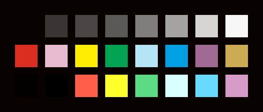
</h3>
<h3 align='center'>
  
apathy

  
</h3>
<h3 align='center'>
  
apprentice

  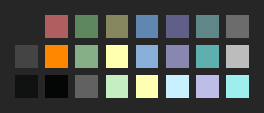
</h3>
<h3 align='center'>
  
ashes

  
</h3>
<h3 align='center'>
  
atelier-cave-light

  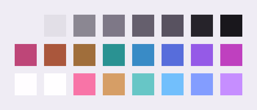
</h3>
<h3 align='center'>
  
atelier-cave

  
</h3>
<h3 align='center'>
  
atelier-dune-light

  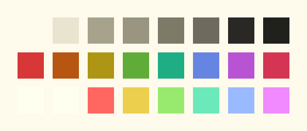
</h3>
<h3 align='center'>
  
atelier-dune

  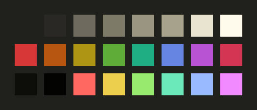
</h3>
<h3 align='center'>
  
atelier-estuary-light

  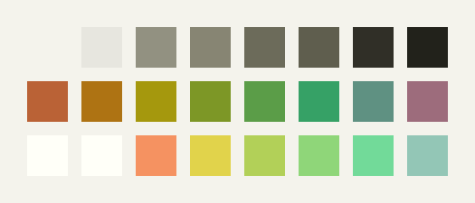
</h3>
<h3 align='center'>
  
atelier-estuary

  
</h3>
<h3 align='center'>
  
atelier-forest-light

  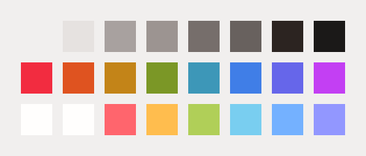
</h3>
<h3 align='center'>
  
atelier-forest

  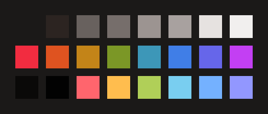
</h3>
<h3 align='center'>
  
atelier-heath-light

  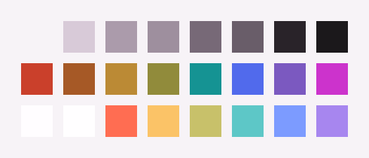
</h3>
<h3 align='center'>
  
atelier-heath

  
</h3>
<h3 align='center'>
  
atelier-lakeside-light

  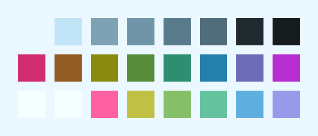
</h3>
<h3 align='center'>
  
atelier-lakeside

  
</h3>
<h3 align='center'>
  
atelier-plateau-light

  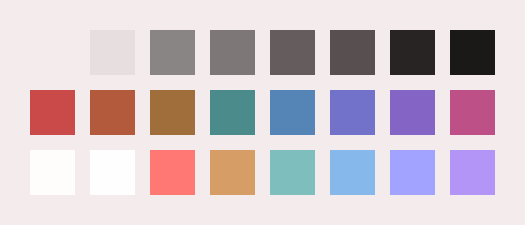
</h3>
<h3 align='center'>
  
atelier-plateau

  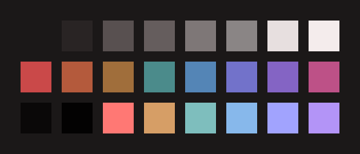
</h3>
<h3 align='center'>
  
atelier-savanna-light

  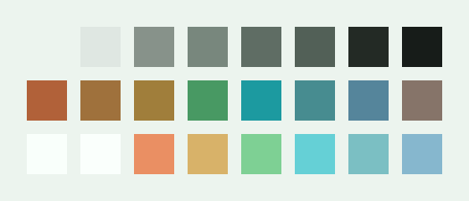
</h3>
<h3 align='center'>
  
atelier-savanna

  
</h3>
<h3 align='center'>
  
atelier-seaside-light

  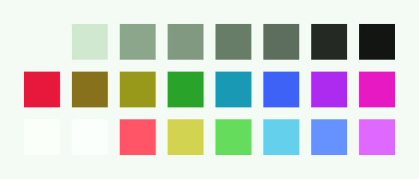
</h3>
<h3 align='center'>
  
atelier-seaside

  
</h3>
<h3 align='center'>
  
atelier-sulphurpool-light

  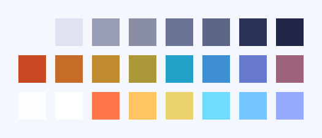
</h3>
<h3 align='center'>
  
atelier-sulphurpool

  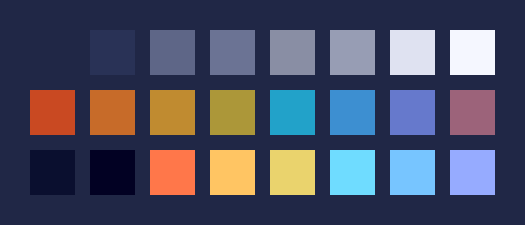
</h3>
<h3 align='center'>
  
atlas

  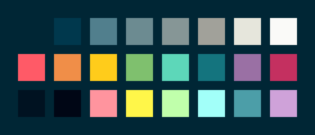
</h3>
<h3 align='center'>
  
ayu-dark

  
</h3>
<h3 align='center'>
  
ayu-light

  
</h3>
<h3 align='center'>
  
ayu-mirage

  
</h3>
<h3 align='center'>
  
aztec

  
</h3>
<h3 align='center'>
  
bespin

  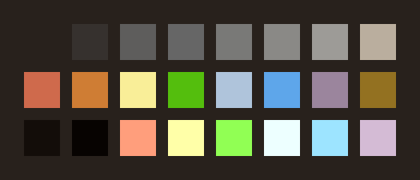
</h3>
<h3 align='center'>
  
black-metal-bathory

  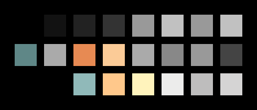
</h3>
<h3 align='center'>
  
black-metal-burzum

  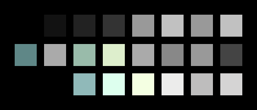
</h3>
<h3 align='center'>
  
black-metal-dark-funeral

  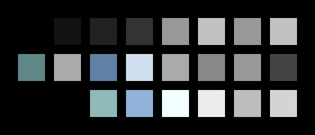
</h3>
<h3 align='center'>
  
black-metal-gorgoroth

  
</h3>
<h3 align='center'>
  
black-metal-immortal

  
</h3>
<h3 align='center'>
  
black-metal-khold

  
</h3>
<h3 align='center'>
  
black-metal-marduk

  
</h3>
<h3 align='center'>
  
black-metal-mayhem

  
</h3>
<h3 align='center'>
  
black-metal-nile

  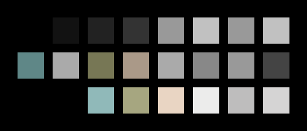
</h3>
<h3 align='center'>
  
black-metal-venom

  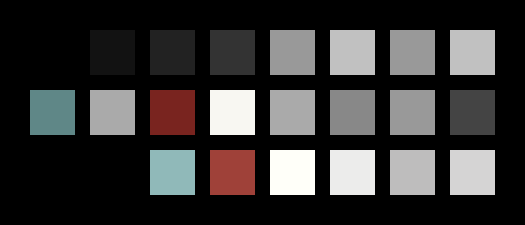
</h3>
<h3 align='center'>
  
black-metal

  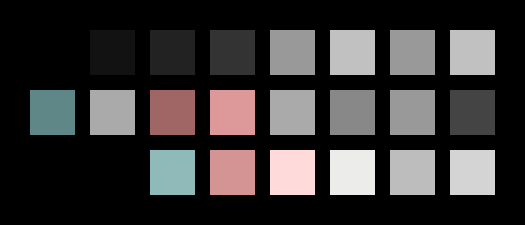
</h3>
<h3 align='center'>
  
blueforest

  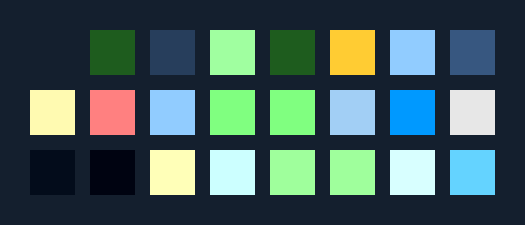
</h3>
<h3 align='center'>
  
blueish

  
</h3>
<h3 align='center'>
  
brewer

  
</h3>
<h3 align='center'>
  
bright

  
</h3>
<h3 align='center'>
  
brogrammer

  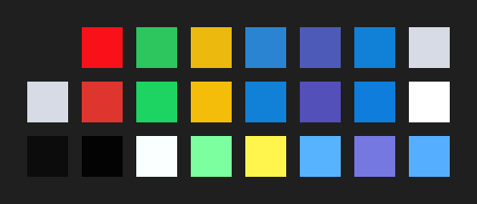
</h3>
<h3 align='center'>
  
brushtrees-dark

  
</h3>
<h3 align='center'>
  
brushtrees

  
</h3>
<h3 align='center'>
  
caroline

  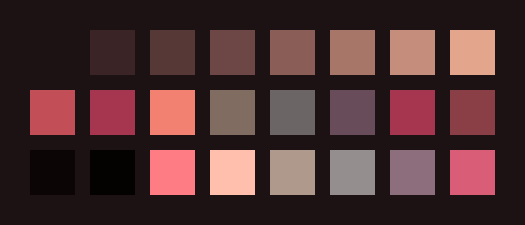
</h3>
<h3 align='center'>
  
catppuccin-frappe

  
</h3>
<h3 align='center'>
  
catppuccin-latte

  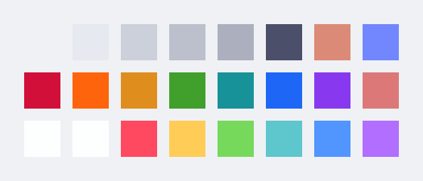
</h3>
<h3 align='center'>
  
catppuccin-macchiato

  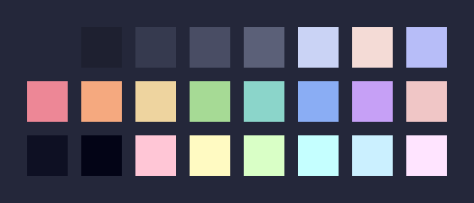
</h3>
<h3 align='center'>
  
catppuccin-mocha

  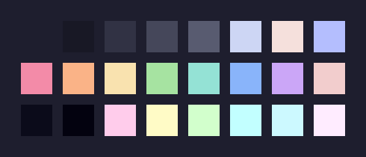
</h3>
<h3 align='center'>
  
chalk

  
</h3>
<h3 align='center'>
  
circus

  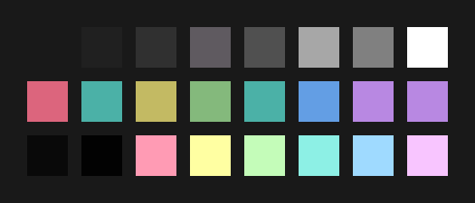
</h3>
<h3 align='center'>
  
classic-dark

  
</h3>
<h3 align='center'>
  
classic-light

  
</h3>
<h3 align='center'>
  
codeschool

  
</h3>
<h3 align='center'>
  
colors

  
</h3>
<h3 align='center'>
  
cupcake

  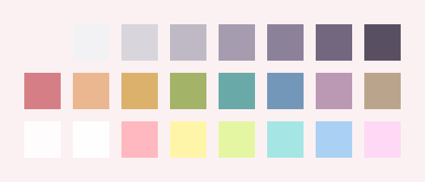
</h3>
<h3 align='center'>
  
cupertino

  
</h3>
<h3 align='center'>
  
danqing-light

  
</h3>
<h3 align='center'>
  
danqing

  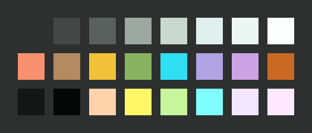
</h3>
<h3 align='center'>
  
da-one-black

  
</h3>
<h3 align='center'>
  
da-one-gray

  
</h3>
<h3 align='center'>
  
da-one-ocean

  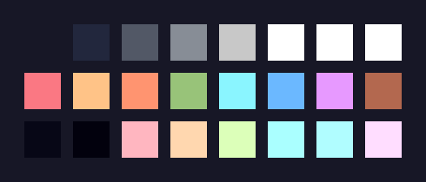
</h3>
<h3 align='center'>
  
da-one-paper

  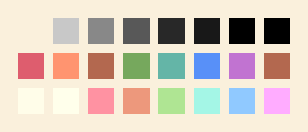
</h3>
<h3 align='center'>
  
da-one-sea

  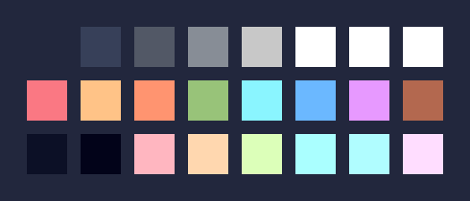
</h3>
<h3 align='center'>
  
da-one-white

  
</h3>
<h3 align='center'>
  
darcula

  
</h3>
<h3 align='center'>
  
darkmoss

  
</h3>
<h3 align='center'>
  
darktooth

  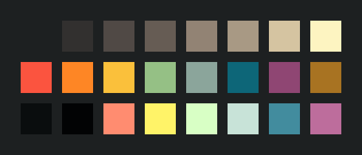
</h3>
<h3 align='center'>
  
darkviolet

  
</h3>
<h3 align='center'>
  
decaf

  
</h3>
<h3 align='center'>
  
deep-oceanic-next

  
</h3>
<h3 align='center'>
  
default-dark

  
</h3>
<h3 align='center'>
  
default-light

  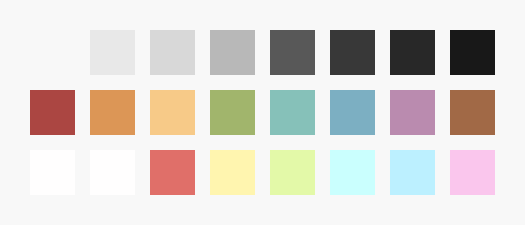
</h3>
<h3 align='center'>
  
dirtysea

  
</h3>
<h3 align='center'>
  
dracula

  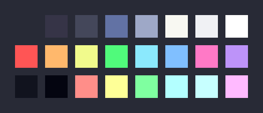
</h3>
<h3 align='center'>
  
edge-dark

  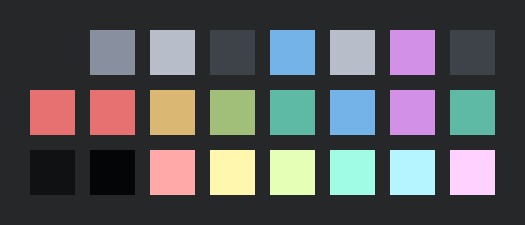
</h3>
<h3 align='center'>
  
edge-light

  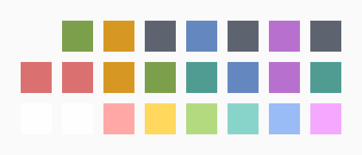
</h3>
<h3 align='center'>
  
eighties

  
</h3>
<h3 align='center'>
  
embers-light

  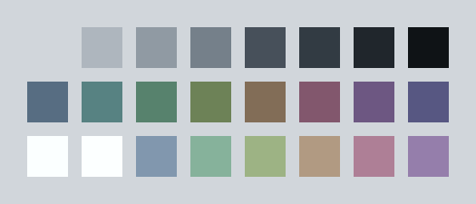
</h3>
<h3 align='center'>
  
embers

  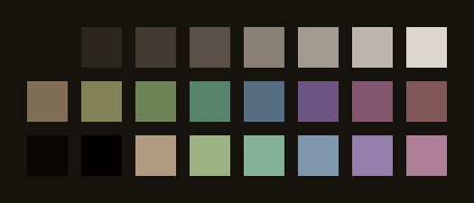
</h3>
<h3 align='center'>
  
emil

  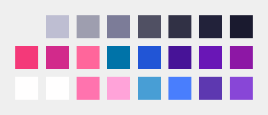
</h3>
<h3 align='center'>
  
equilibrium-dark

  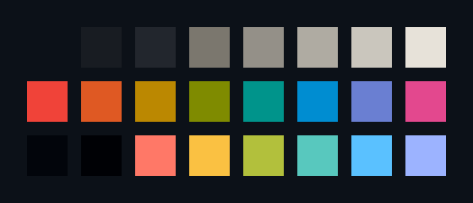
</h3>
<h3 align='center'>
  
equilibrium-gray-dark

  
</h3>
<h3 align='center'>
  
equilibrium-gray-light

  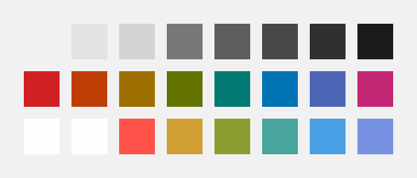
</h3>
<h3 align='center'>
  
equilibrium-light

  
</h3>
<h3 align='center'>
  
eris

  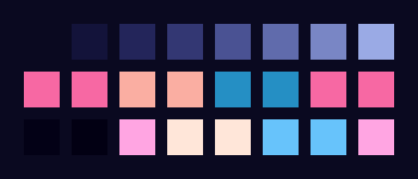
</h3>
<h3 align='center'>
  
espresso

  
</h3>
<h3 align='center'>
  
eva-dim

  
</h3>
<h3 align='center'>
  
eva

  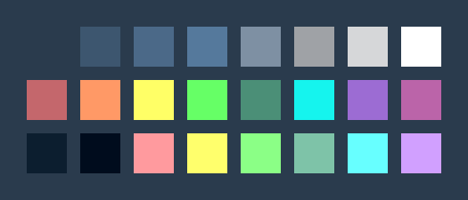
</h3>
<h3 align='center'>
  
evenok-dark

  
</h3>
<h3 align='center'>
  
everforest-dark-hard

  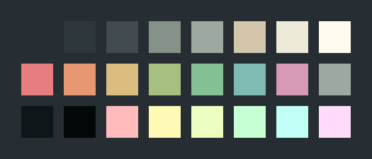
</h3>
<h3 align='center'>
  
everforest

  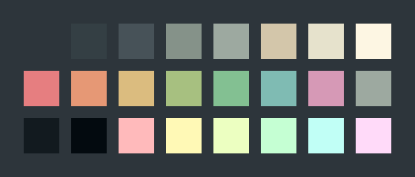
</h3>
<h3 align='center'>
  
flat

  
</h3>
<h3 align='center'>
  
framer

  
</h3>
<h3 align='center'>
  
fruit-soda

  
</h3>
<h3 align='center'>
  
gigavolt

  
</h3>
<h3 align='center'>
  
github

  
</h3>
<h3 align='center'>
  
google-dark

  
</h3>
<h3 align='center'>
  
google-light

  
</h3>
<h3 align='center'>
  
gotham

  
</h3>
<h3 align='center'>
  
grayscale-dark

  
</h3>
<h3 align='center'>
  
grayscale-light

  
</h3>
<h3 align='center'>
  
greenscreen

  
</h3>
<h3 align='center'>
  
gruber

  
</h3>
<h3 align='center'>
  
gruvbox-dark-hard

  
</h3>
<h3 align='center'>
  
gruvbox-dark-medium

  
</h3>
<h3 align='center'>
  
gruvbox-dark-pale

  
</h3>
<h3 align='center'>
  
gruvbox-dark-soft

  
</h3>
<h3 align='center'>
  
gruvbox-light-hard

  
</h3>
<h3 align='center'>
  
gruvbox-light-medium

  
</h3>
<h3 align='center'>
  
gruvbox-light-soft

  
</h3>
<h3 align='center'>
  
gruvbox-material-dark-hard

  
</h3>
<h3 align='center'>
  
gruvbox-material-dark-medium

  
</h3>
<h3 align='center'>
  
gruvbox-material-dark-soft

  
</h3>
<h3 align='center'>
  
gruvbox-material-light-hard

  
</h3>
<h3 align='center'>
  
gruvbox-material-light-medium

  
</h3>
<h3 align='center'>
  
gruvbox-material-light-soft

  
</h3>
<h3 align='center'>
  
hardcore

  
</h3>
<h3 align='center'>
  
harmonic16-dark

  
</h3>
<h3 align='center'>
  
harmonic16-light

  
</h3>
<h3 align='center'>
  
heetch-light

  
</h3>
<h3 align='center'>
  
heetch

  
</h3>
<h3 align='center'>
  
helios

  
</h3>
<h3 align='center'>
  
hopscotch

  
</h3>
<h3 align='center'>
  
horizon-dark

  
</h3>
<h3 align='center'>
  
horizon-light

  
</h3>
<h3 align='center'>
  
horizon-terminal-dark

  
</h3>
<h3 align='center'>
  
horizon-terminal-light

  
</h3>
<h3 align='center'>
  
humanoid-dark

  
</h3>
<h3 align='center'>
  
humanoid-light

  
</h3>
<h3 align='center'>
  
ia-dark

  
</h3>
<h3 align='center'>
  
ia-light

  
</h3>
<h3 align='center'>
  
icy

  
</h3>
<h3 align='center'>
  
irblack

  
</h3>
<h3 align='center'>
  
isotope

  
</h3>
<h3 align='center'>
  
jabuti

  
</h3>
<h3 align='center'>
  
kanagawa

  
</h3>
<h3 align='center'>
  
katy

  
</h3>
<h3 align='center'>
  
kimber

  
</h3>
<h3 align='center'>
  
lime

  
</h3>
<h3 align='center'>
  
macintosh

  
</h3>
<h3 align='center'>
  
marrakesh

  
</h3>
<h3 align='center'>
  
material-darker

  
</h3>
<h3 align='center'>
  
material-lighter

  
</h3>
<h3 align='center'>
  
material-palenight

  
</h3>
<h3 align='center'>
  
material-vivid

  
</h3>
<h3 align='center'>
  
material

  
</h3>
<h3 align='center'>
  
materia

  
</h3>
<h3 align='center'>
  
measured-dark

  
</h3>
<h3 align='center'>
  
measured-light

  
</h3>
<h3 align='center'>
  
mellow-purple

  
</h3>
<h3 align='center'>
  
mexico-light

  
</h3>
<h3 align='center'>
  
mocha

  
</h3>
<h3 align='center'>
  
monokai

  
</h3>
<h3 align='center'>
  
moonlight

  
</h3>
<h3 align='center'>
  
mountain

  
</h3>
<h3 align='center'>
  
nebula

  
</h3>
<h3 align='center'>
  
nord-light

  
</h3>
<h3 align='center'>
  
nord

  
</h3>
<h3 align='center'>
  
nova

  
</h3>
<h3 align='center'>
  
oceanicnext

  
</h3>
<h3 align='center'>
  
ocean

  
</h3>
<h3 align='center'>
  
onedark-dark

  
</h3>
<h3 align='center'>
  
onedark

  
</h3>
<h3 align='center'>
  
one-light

  
</h3>
<h3 align='center'>
  
outrun-dark

  
</h3>
<h3 align='center'>
  
oxocarbon-dark

  
</h3>
<h3 align='center'>
  
oxocarbon-light

  
</h3>
<h3 align='center'>
  
pandora

  
</h3>
<h3 align='center'>
  
papercolor-dark

  
</h3>
<h3 align='center'>
  
papercolor-light

  
</h3>
<h3 align='center'>
  
paraiso

  
</h3>
<h3 align='center'>
  
pasque

  
</h3>
<h3 align='center'>
  
phd

  
</h3>
<h3 align='center'>
  
pico

  
</h3>
<h3 align='center'>
  
pinky

  
</h3>
<h3 align='center'>
  
pop

  
</h3>
<h3 align='center'>
  
porple

  
</h3>
<h3 align='center'>
  
precious-dark-eleven

  
</h3>
<h3 align='center'>
  
precious-dark-fifteen

  
</h3>
<h3 align='center'>
  
precious-light-warm

  
</h3>
<h3 align='center'>
  
precious-light-white

  
</h3>
<h3 align='center'>
  
primer-dark-dimmed

  
</h3>
<h3 align='center'>
  
primer-dark

  
</h3>
<h3 align='center'>
  
primer-light

  
</h3>
<h3 align='center'>
  
purpledream

  
</h3>
<h3 align='center'>
  
qualia

  
</h3>
<h3 align='center'>
  
railscasts

  
</h3>
<h3 align='center'>
  
rebecca

  
</h3>
<h3 align='center'>
  
rose-pine-dawn

  
</h3>
<h3 align='center'>
  
rose-pine-moon

  
</h3>
<h3 align='center'>
  
rose-pine

  
</h3>
<h3 align='center'>
  
saga

  
</h3>
<h3 align='center'>
  
sagelight

  
</h3>
<h3 align='center'>
  
sakura

  
</h3>
<h3 align='center'>
  
sandcastle

  
</h3>
<h3 align='center'>
  
selenized-black

  
</h3>
<h3 align='center'>
  
selenized-dark

  
</h3>
<h3 align='center'>
  
selenized-light

  
</h3>
<h3 align='center'>
  
selenized-white

  
</h3>
<h3 align='center'>
  
seti

  
</h3>
<h3 align='center'>
  
shadesmear-dark

  
</h3>
<h3 align='center'>
  
shadesmear-light

  
</h3>
<h3 align='center'>
  
shades-of-purple

  
</h3>
<h3 align='center'>
  
shapeshifter

  
</h3>
<h3 align='center'>
  
silk-dark

  
</h3>
<h3 align='center'>
  
silk-light

  
</h3>
<h3 align='center'>
  
snazzy

  
</h3>
<h3 align='center'>
  
solarflare-light

  
</h3>
<h3 align='center'>
  
solarflare

  
</h3>
<h3 align='center'>
  
solarized-dark

  
</h3>
<h3 align='center'>
  
solarized-light

  
</h3>
<h3 align='center'>
  
spaceduck

  
</h3>
<h3 align='center'>
  
spacemacs

  
</h3>
<h3 align='center'>
  
sparky

  
</h3>
<h3 align='center'>
  
standardized-dark

  
</h3>
<h3 align='center'>
  
standardized-light

  
</h3>
<h3 align='center'>
  
stella

  
</h3>
<h3 align='center'>
  
still-alive

  
</h3>
<h3 align='center'>
  
summercamp

  
</h3>
<h3 align='center'>
  
summerfruit-dark

  
</h3>
<h3 align='center'>
  
summerfruit-light

  
</h3>
<h3 align='center'>
  
synth-midnight-dark

  
</h3>
<h3 align='center'>
  
synth-midnight-light

  
</h3>
<h3 align='center'>
  
tango

  
</h3>
<h3 align='center'>
  
tarot

  
</h3>
<h3 align='center'>
  
tender

  
</h3>
<h3 align='center'>
  
terracotta-dark

  
</h3>
<h3 align='center'>
  
terracotta

  
</h3>
<h3 align='center'>
  
tokyo-city-dark

  
</h3>
<h3 align='center'>
  
tokyo-city-light

  
</h3>
<h3 align='center'>
  
tokyo-city-terminal-dark

  
</h3>
<h3 align='center'>
  
tokyo-city-terminal-light

  
</h3>
<h3 align='center'>
  
tokyodark-terminal

  
</h3>
<h3 align='center'>
  
tokyodark

  
</h3>
<h3 align='center'>
  
tokyo-night-dark

  
</h3>
<h3 align='center'>
  
tokyo-night-light

  
</h3>
<h3 align='center'>
  
tokyo-night-moon

  
</h3>
<h3 align='center'>
  
tokyo-night-storm

  
</h3>
<h3 align='center'>
  
tokyo-night-terminal-dark

  
</h3>
<h3 align='center'>
  
tokyo-night-terminal-light

  
</h3>
<h3 align='center'>
  
tokyo-night-terminal-storm

  
</h3>
<h3 align='center'>
  
tomorrow-night-eighties

  
</h3>
<h3 align='center'>
  
tomorrow-night

  
</h3>
<h3 align='center'>
  
tomorrow

  
</h3>
<h3 align='center'>
  
tube

  
</h3>
<h3 align='center'>
  
twilight

  
</h3>
<h3 align='center'>
  
unikitty-dark

  
</h3>
<h3 align='center'>
  
unikitty-light

  
</h3>
<h3 align='center'>
  
unikitty-reversible

  
</h3>
<h3 align='center'>
  
uwunicorn

  
</h3>
<h3 align='center'>
  
vesper

  
</h3>
<h3 align='center'>
  
vice

  
</h3>
<h3 align='center'>
  
vulcan

  
</h3>
<h3 align='center'>
  
windows-10-light

  
</h3>
<h3 align='center'>
  
windows-10

  
</h3>
<h3 align='center'>
  
windows-95-light

  
</h3>
<h3 align='center'>
  
windows-95

  
</h3>
<h3 align='center'>
  
windows-highcontrast-light

  
</h3>
<h3 align='center'>
  
windows-highcontrast

  
</h3>
<h3 align='center'>
  
windows-nt-light

  
</h3>
<h3 align='center'>
  
windows-nt

  
</h3>
<h3 align='center'>
  
woodland

  
</h3>
<h3 align='center'>
  
xcode-dusk

  
</h3>
<h3 align='center'>
  
zenbones

  
</h3>
<h3 align='center'>
  
zenburn

  
</h3>
